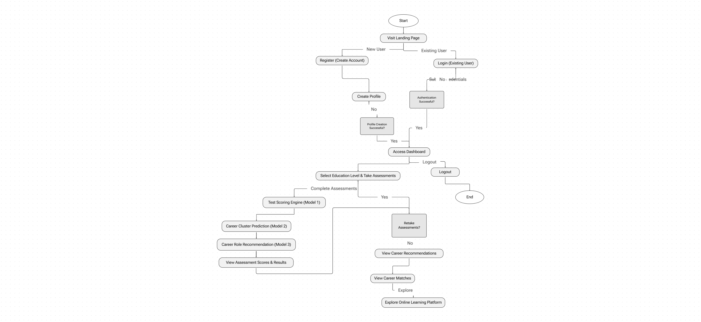
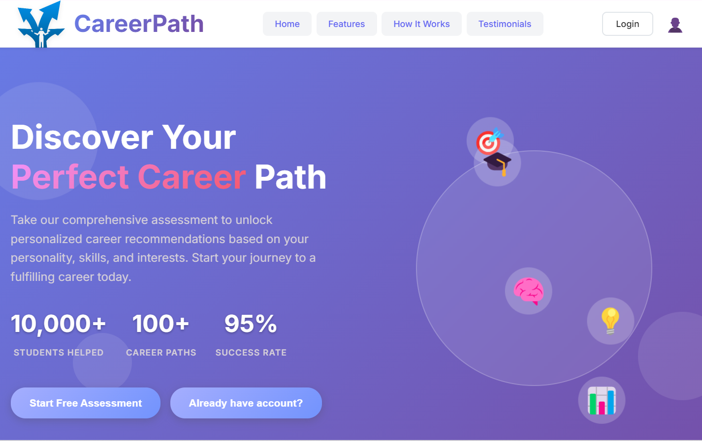
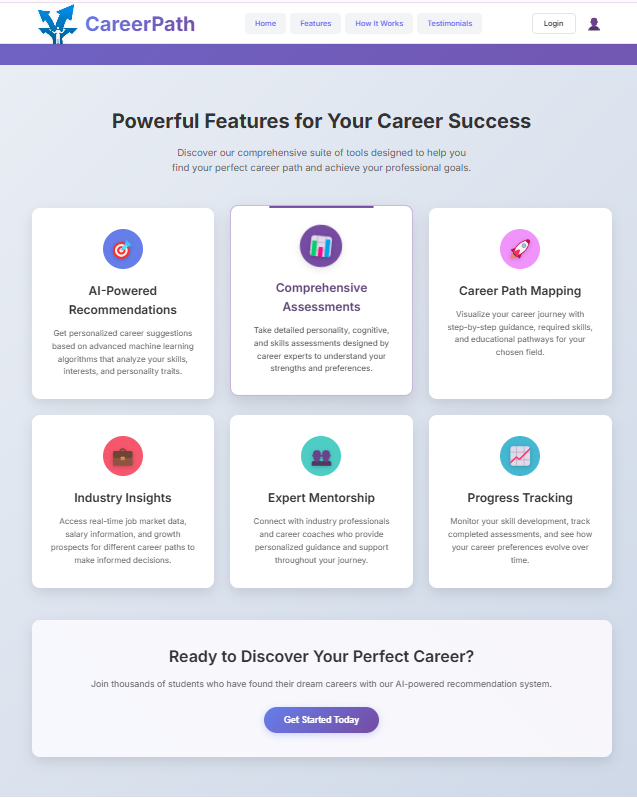
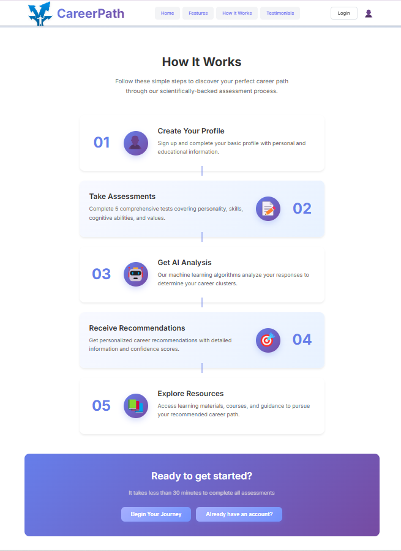
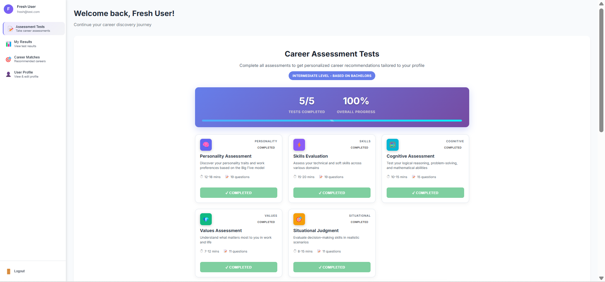
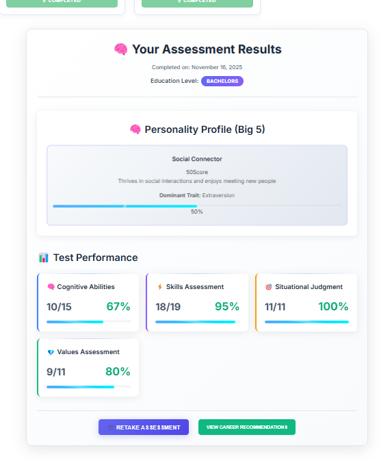
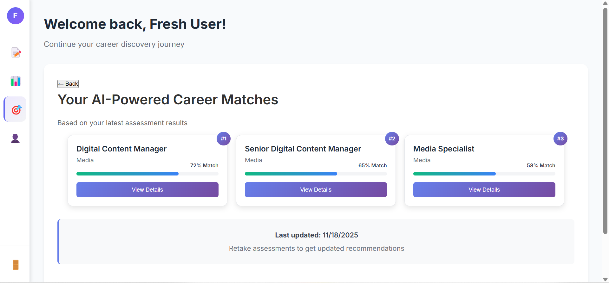

# 🚀 AI-Powered Career Path Recommendation System

> An intelligent, full-stack web application designed to guide students toward their ideal career paths using psychometric assessments and AI-driven analysis.

---

## 📖 Table of Contents
- [Overview](#-overview)
- [Key Features](#-key-features)
- [System Architecture](#-system-architecture)
- [Screenshots](#-screenshots)
- [Tech Stack](#-tech-stack)
- [Installation & Setup](#-installation--setup)
- [Environment Variables](#-environment-variables)
- [Future Roadmap](#-future-roadmap)
- [Contact](#-contact)

---

## 💡 Overview
The **Career Path Recommendation System (CPRS)** addresses the confusion students face when choosing a career. By combining traditional psychometric testing (Big Five Personality, Skills, Cognitive abilities) with modern AI (Large Language Models), this system provides personalized, data-backed career advice.

The system evaluates a student's profile and recommends specific career clusters and job roles, complete with learning resources and college filters.

---

## ✨ Key Features
* **🔐 Secure Authentication:** User registration and login using JWT (JSON Web Tokens) with secure password hashing.
* **🧠 5-Part Assessment Engine:** Interactive tests covering:
    * Personality Traits (Big Five)
    * Cognitive Abilities
    * Technical & Soft Skills
    * Situational Judgment
    * Core Values
* **📊 ML-Based Recommendations:** Uses decision trees and hybrid filtering to match user scores with 16+ career clusters and 200+ job roles.
* **📈 Interactive Dashboard:** After assessments, the dashboard displays model scores and provides career roadmaps, educational requirements, salary expectations, and integrated learning resources. Users can choose to **Retake Assessments** for better recommendations.
* **🗺 Career Matches:** This section displays **four cards** representing the top predicted career roles. Each card includes an **Explore** button that links the user to an external online learning platform.
* 
---

## 🏗 System Architecture

---

## 📸 Screenshots

### 1. Landing Page

### 2. Student Dashboard & Results

---

## 🛠 Tech Stack

| Component | Technology |
| :--- | :--- |
| **Frontend** | **React.js**, HTML5, CSS3, Context API |
| **Backend** | **Node.js, Express.js** |
| **Database** | **MongoDB** (User profiles, test responses) |
| **AI / ML** | Python (Scikit-learn), Decision Tree, Random Forest, KNN |
| **Authentication** | JWT, Bcrypt.js |

---

### Prerequisites
* Node.js installed
* MongoDB installed locally or a MongoDB Atlas account
* Git installed
* 
### 🚀 Future Roadmap
> Turning this project into a Dynamic Web for all Students.
[ ] Advanced College Filters: Filter by geolocation and specific cutoff marks.
[ ] Downloadable Reports: Generate PDF reports of career analysis.
[ ] Community Forum: Allow students to discuss career paths.

### 👤 Author
Smiti Badugu
Role: Full Stack Developer & Data Science Student
Institution: S.I.E.S. College of Arts, Science & Commerce
Made with ❤️ and ☕ for the final year project.
